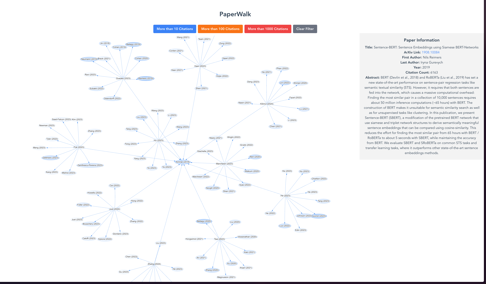

# PaperWalk
Random walk on the shoulders of giants



## Installation
### Backend
```
pip install -r requirements.txt
pip install -e .
```

### Frontend
```
cd frontend
npm install
```

## Usage
### Backend
```
python src/paperwalk/database/database.py
```

### Frontend
```
cd frontend
npm run serve
```